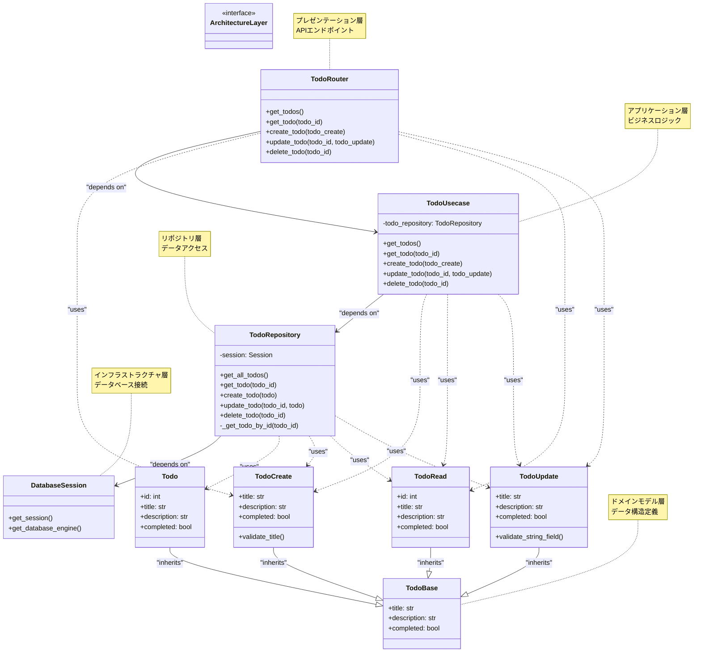

# FastApiによるTodoアプリ

## 起動方法

### 開発サーバーの起動
```bash
uv run fastapi dev app/main.py
```

### 本番サーバーの起動
```bash
uv run fastapi run app/main.py
```

## エンドポイント

- **ベースURL**: http://127.0.0.1:8000
- **APIドキュメント**: http://127.0.0.1:8000/docs
- **ReDoc**: http://127.0.0.1:8000/redoc

## 利用可能なAPIエンドポイント

- `GET /`: Hello Worldメッセージを返す
- `GET /todos`: すべてのTodoを取得
- `GET /todos/{todo_id}`: 指定されたIDのTodoを取得
- `POST /todos`: 新しいTodoを作成
- `PUT /todos/{todo_id}`: 指定されたIDのTodoを更新
- `DELETE /todos/{todo_id}`: 指定されたIDのTodoを削除

## アーキテクチャ

本プロジェクトはクリーンアーキテクチャパターンを採用しています。各レイヤーは単一の責務を持ち、依存関係が一方向になるよう設計されています。

### レイヤー構成

1. **プレゼンテーション層** (`routers/`)
   - FastAPIルーターによるHTTPエンドポイント
   - HTTPリクエスト/レスポンスの処理

2. **アプリケーション層** (`usecases/`)
   - ビジネスロジックの実装
   - ユースケースの実行

3. **リポジトリ層** (`repositories/`)
   - データアクセスの抽象化
   - データベース操作の実装

4. **インフラストラクチャ層** (`infrastructure/`)
   - データベース接続の管理
   - 外部サービスとの統合

5. **ドメインモデル層** (`models/`)
   - ビジネスドメインの概念をモデル化
   - データの構造と制約を定義

## クラス間の依存関係図



### 設計の特徴

- **依存関係の逆転**: 各層は抽象化に依存し、具象に依存しない設計
- **関心の分離**: 各レイヤーが単一の責務を持つ
- **テスタビリティ**: 依存性注入により、単体テストが容易
- **保守性**: 各レイヤーの変更が他のレイヤーに影響しにくい構造

